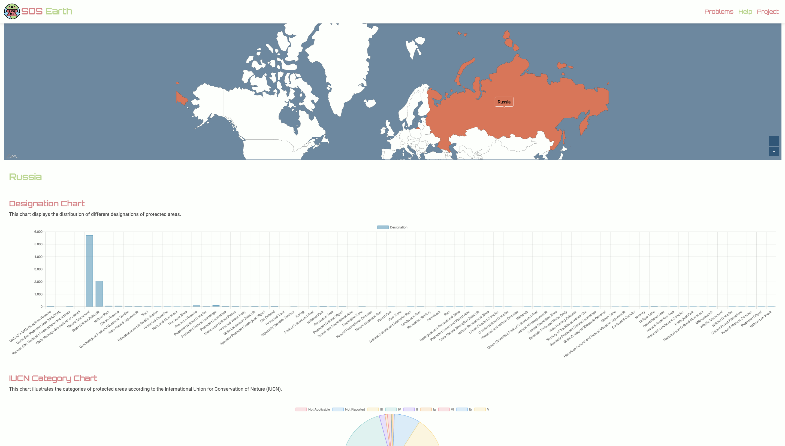

  

<h1 align="center" style="margin: 0;">SOS Earth</h1>

<em>Progetto realizzato per il corso di Basi di Dati 2 - Università degli Studi di Salerno 2023/24</em>

## Introduzione
Il progetto _SOS Earth_ mira a sensibilizzare il pubblico sui problemi ambientali globali attraverso l'uso di visualizzazioni interattive dei dati. Utilizzando dati accurati e aggiornati, _SOS Earth_ offre uno strumento intuitivo e coinvolgente per esplorare e comprendere le complesse dinamiche delle crisi ambientali.

## Obiettivi del Progetto
Il principale obiettivo di _SOS Earth_ è educare e sensibilizzare il pubblico sui problemi ambientali, fornendo uno strumento che renda accessibili e comprensibili i dati complessi. In particolare, il progetto si propone di:
- Fornire informazioni accurate e aggiornate sugli indicatori ambientali.
- Evidenziare le cause e gli effetti dei principali problemi ambientali.
- Facilitare la comprensione delle interconnessioni tra diversi fenomeni ambientali.
- Promuovere un maggiore impegno verso la sostenibilità e la conservazione dell'ambiente.

## Struttura del Progetto
_SOS Earth_ è composto da tre componenti principali: frontend, backend e processo ETL.

### Frontend
Una piattaforma web interattiva che permette agli utenti di esplorare i dati ambientali attraverso grafici dinamici e dettagliati. Costruita con tecnologie moderne di sviluppo web, offre un'esperienza utente fluida e reattiva.

### Backend
Utilizza un data warehouse per integrare e analizzare dati provenienti da 34 dataset distinti, coprendo vari indicatori ambientali come la biosfera, gli oceani, l'atmosfera, e molti altri.

### Processo ETL
- **Estrazione (Extract):** Recupero dei dati dai diversi dataset.
- **Trasformazione (Transform):** Pulizia, normalizzazione e arricchimento dei dati.
- **Caricamento (Load):** Inserimento dei dati trasformati nel data warehouse.

## Funzionalità del Sito
Il sito _SOS Earth_ offre diverse pagine interattive:

- **Home:** Panoramica generale del progetto e delle sue funzionalità.

- **Problem:** Analisi approfondita dei principali problemi ambientali globali con visualizzazioni interattive.
 
- **Help:** Raccomandazioni pratiche e strategie per mitigare gli effetti negativi degli indicatori ambientali critici.
  
- **Project:** Planisfero interattivo delle aree protette nei vari paesi.
 
- **Calcolatore di Foodprint:** Strumento per calcolare l'impatto di $CO_2$ delle scelte alimentari.
   
- **Indicators:** Esplorazione dei dati storici per ciascun indicatore ambientale.
   

## Dataset

Il progetto utilizza 34 dataset distinti provenienti da fonti affidabili. I dettagli su ciascun dataset sono disponibili nella documentazione del progetto.

## Tecnologie Utilizzate

### Data Warehouse
**MongoDB**: Utilizzato come data warehouse per la raccolta, gestione e analisi dei dati. Offre vantaggi in termini di integrazione dei dati, efficienza di query, gestione dello storico dei dati, scalabilità e qualità dei dati.
Linguaggi e Librerie
### Python per il Processo ETL

- Pandas: Per la manipolazione e l'analisi dei dati.
- NumPy: Per operazioni numeriche ad alte prestazioni.
- Flask per le API REST

Flask: Un micro framework per Python, scelto per la sua semplicità, flessibilità e modularità.
### JavaScript per l'Interattività

- Chart.js: Per creare grafici dinamici e interattivi.
- Bootstrap: Per lo sviluppo di design reattivi e moderni.
- amCharts5.js (am5.js): Per visualizzazioni di dati complesse e dettagliate.

